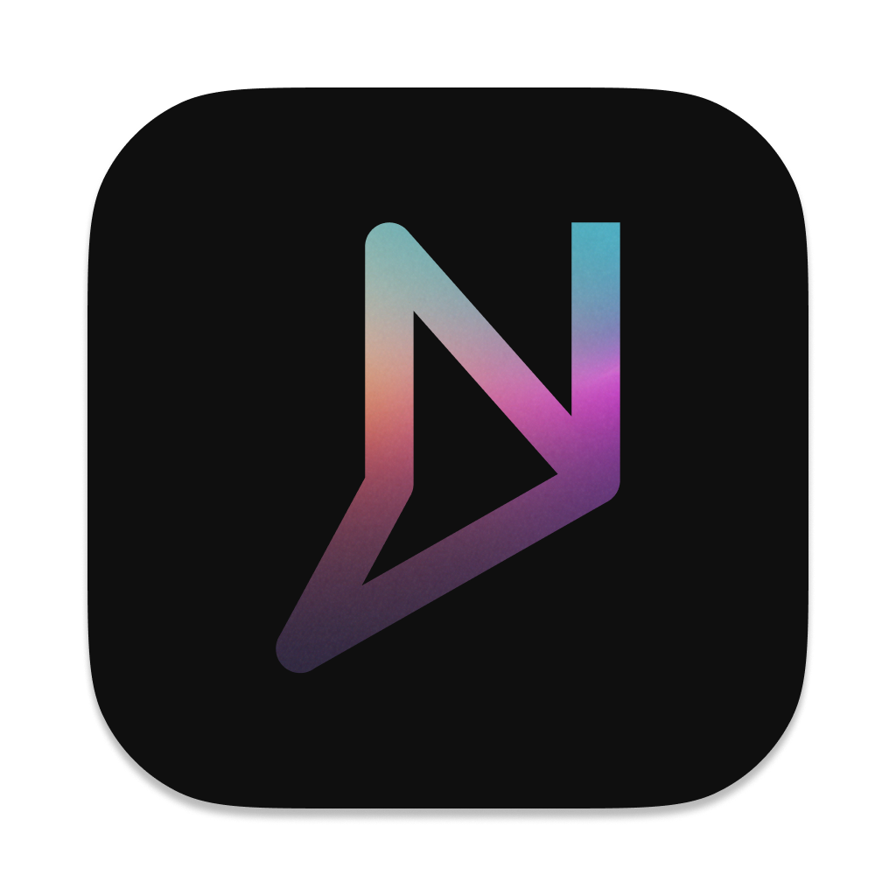

<div align="center">
  
</div>

# Nash MCP Electron App

This is a simple Electron application that provides a setup flow for the Nash MCP.


### Prerequisites

- Node.js (v14 or later)
- npm or yarn

### Installation

```bash
# Install dependencies
npm install
# or
yarn install
```

### Running the app

```bash
# Start the app in development mode
npm start
# or
yarn start
```

### Building the app

```bash
# Build the app for production
npm run make
# or
yarn make
```

