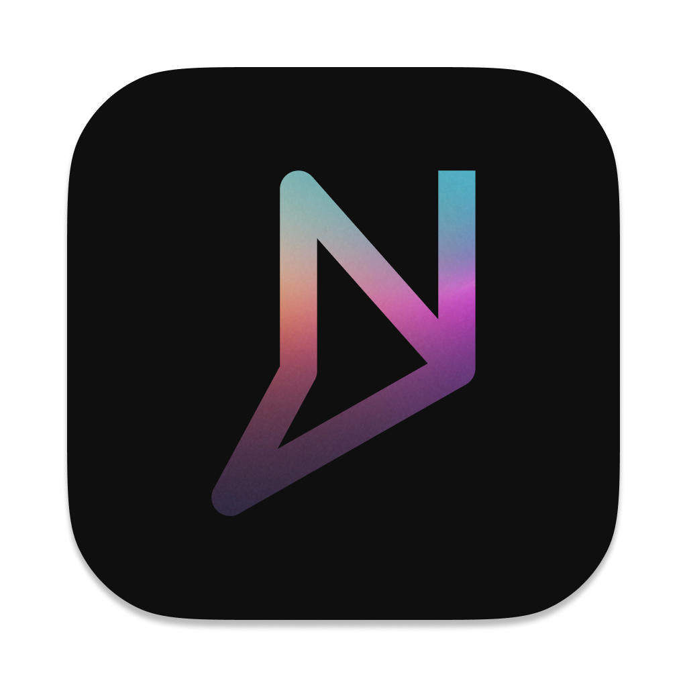

<div align="center">
  
</div>

# Nash MCP Electron App

This is a simple Electron application that provides a setup flow for the Nash MCP.

### Prerequisites

- Node.js (v14 or later)
- npm or yarn

### Installation

```bash
# Install dependencies
npm install
# or
yarn install
```

### Running the app

```bash
# Start the app in development mode
npm start
# or
yarn start
```

### Building the app

```bash
# Build the app for production
npm run make
# or
yarn make
```

## Releases

Nash uses GitHub releases for distribution and automatic updates. When you publish a new release, users will automatically receive update notifications.

### Setting Up for Publishing

1. **Create a GitHub token** with `repo` scope:

   - Go to GitHub → Settings → Developer Settings → Personal Access Tokens
   - Create a token with "repo" permissions
   - Copy the token value

2. **Add the token to your environment**:
   - Create or update `.env` file in the project root:
     ```
     GITHUB_TOKEN=your_token_here
     ```
   - ⚠️ Never commit this file to Git!

### Publishing Commands

| Command                        | Description                                  |
| ------------------------------ | -------------------------------------------- |
| `npm run publish`              | Create a draft release on GitHub             |
| `npm run publish-test`         | Bump patch version and create a test release |
| `npm run prerelease-check`     | Dry-run to validate publishing works         |
| `npm run enable-draft-updates` | Enable testing with draft releases           |

### Publishing Workflow

#### Standard Release Process

1. Make sure your changes are committed and the version in `package.json` is correct
2. Run `npm run publish`
3. Go to GitHub releases, review the draft, and publish when ready

#### Testing Updates Locally

1. Run `npm run enable-draft-updates` (one-time setup)
2. Run `npm run publish-test`
3. This creates a draft release and bumps the patch version
4. Install the previous version on your test device
5. The app will detect the update from the draft release

#### Development Notes

- Updates are managed by `electron-updater` in `src/index.ts`
- The UI component is in `src/components/UpdateNotification.tsx`
- Draft releases are only visible to repo collaborators
- Users will only see published releases

### Troubleshooting

- If publish fails, ensure your GitHub token is valid and has repo permissions
- For testing, ensure `USE_DRAFT_RELEASES=true` is in your `.env` file
- Check logs at:
  - macOS: `~/Library/Logs/Nash/main.log`
  - Windows: `%USERPROFILE%\AppData\Roaming\Nash\logs\main.log`
